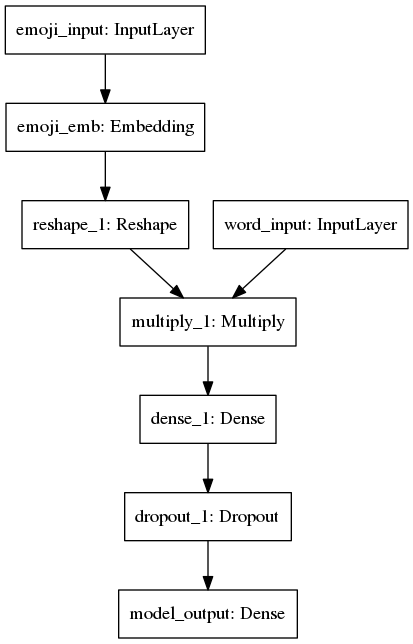
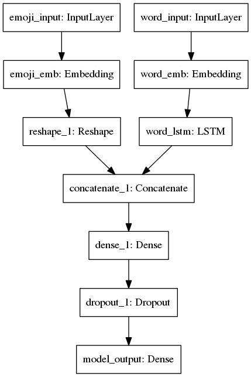
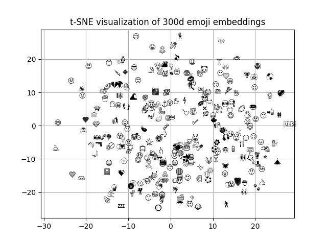

# emoji2vec

This repository presents my attempt to train, visualize and evaluate emoji embeddings as described by Ben Eisner, Tim Rocktäschel, Isabelle Augenstein, Matko Bošnjak, and Sebastian Riedel in their paper [[1]](https://arxiv.org/abs/1609.08359), but instead of using word2vec (as it was originally proposed), this code uses global vectors [[2]](http://nlp.stanford.edu/pubs/glove.pdf).

## Overview
* [src/](src) contains the code used to process the emoji descriptions, train and evaluate the emoji embeddings
* [res/](res) contains the positive and negative samples used to train the emoji embeddings (from the original paper, available [here](https://github.com/uclmr/emoji2vec/blob/master/data/raw_training_data/emoji_joined.txt)) as well as a list of emoji frequencies; it should also contain a directory called *glove/* where all the global vectors should be extracted as described in the installation instructions below
* [models/](models) contains all the pretrained emoji2vec models
* [plots/](plots) contains some visualizations for the emoji embeddings obtained

## Dependencies

The code included in this repository has been tested to work with Python 3.5 on an Ubuntu 16.04 machine, using Keras 2.0.8 with Tensorflow as the backend.

#### List of requirements
* [Python](https://www.python.org/downloads/) 3.5
* [Keras](https://github.com/fchollet/keras) 2.0
* [Tensorflow](https://www.tensorflow.org/install/) 1.3
* [numpy](https://github.com/numpy/numpy) 1.13
* [scikit-learn](https://github.com/scikit-learn/scikit-learn)
* [h5py](https://github.com/h5py/h5py)
* [pandas](https://github.com/pandas-dev/pandas)
* [matplotlib](https://github.com/matplotlib/matplotlib)

## Implementation notes

Just as the original paper, this model trains on 6088 descriptions of 1661 distinct emoji symbols.
Since all descriptions are valid, we randomly sample negative instances so that there is one positive example
per negative example. This approach proved to produce the best results, as stated in the original paper.

There are two architectures on which emoji vectors have been trained:

- one based on the sum of the individual word vectors
of the emoji descriptions



- the other feeds the actual word embeddings 
to an LSTM layer (set *use_lstm=True*)



Not like in the original paper, we used global vectors which need to be downloaded and placed in the [res/glove](res/glove/) directory. You can either download them from the original GloVe [page](https://nlp.stanford.edu/projects/glove/) or by running:

```{r, engine='bash', count_lines}
! wget -q http://nlp.stanford.edu/data/glove.6B.zip
! unzip -q -o glove.6B.zip
! rm -f glove.6B.zip glove.6B.50d.txt glove.6B.100d.txt glove.6B.200d.txt
```

## Arguments
All the hyperparameters can be easily changed through a command line interface as described below:

- `-d`: embedding dimension for both the global vectors and the emoji vectors (default 300)
- `-b`: batch size (default 8)
- `-e`: number of epochs (default 80, but we always perform early-stopping)
- `-dr`: dropout rate (default 0.3)
- `-lr`: learning rate (default 0.001)
- `-u`: number of hidden units in the dense layer (default 600)
- `-l`: boolean to set using the LSTM architecture or not (default False)
- `-s`: maximum sequence length (needed only if use_lstm=True, default 10)

## Training your own emoji2vec

To train your own emoji embeddings with different combination of the
hyperparameters, run:

```{r, engine='python', count_lines}
python3 emoji2vec.py -d=300 -b=8 -e=40 -dr=0.5 -lr=0.001 -u=300 -l=True -s=20 
```

Running this will create and save several files:
- in [models/](models) it will save the weights of the model (*.h5* format), a *.txt* file with the vector representations for every trained emoji, a *.csv* file containing the x,y coordinates ina  2-dimensional t-sne representation of the vector space produced after training the model
- in [plots/](plots) it will save two plots for the accuracy and loss reached while training as well as a 2D visualization for the emoji vector space 
- it will also make some analogies to evaluate the meaning behind the trained vectorized emojis (printed on the standard output)


## Using the pre-trained models

Pretrained emoji embeddings are available for download and usage.
There are 50, 100, 200 and 300 dimensional embeddings available, but any dimension can be trained manually (you need to provide word embeddings of the same dimension, though). 

For the pre-trained embeddings provided, the following hyperparameter settings have been made 
(respecting, in large terms, the original authors' decisions):

- batch: 8
- epochs: 40
- dense_units: 600
- dropout: 0.0
- learning_rate: 0.001
- seq_length: 10
- use_lstm: False

Example code for how to use emoji embeddings, after downloading them and setting up their dimension:

```{r, engine='python', count_lines}
from utils import load_vectors

embeddings_filename = "/models/emoji_embeddings_%dd.txt" % embedding_dim
emoji2vec = utils.load_vectors(filename=embeddings_filename)

# Get the embedding vector of length embedding_dim for the dog emoji
dog_vector = emoji2vec['🐕']
```

## Visualization

A nice visualization of the emoji embeddings, use t-SNE to project from N-dimensions into 2 dimensions. We only projected a fraction of the most frequent emojis (extracted according to [emoji_frequencies.txt](res/emoji_frequencies.txt)) for practical purposes.

Here, the top 200 most popular emojis have been projected:




## Making emoji analogies

To evaluate the meaning accumulated from the words, emojis are put under an analogy experiment: we try to predict the 5 most suitable emojis to fit "a - b + c = ?" (a is to b as c is to ?). This comes from the popular analogies that we can make with word embeddings (king - man + woman = *queen*)


## License

The source code and all my pretrained models are licensed under the MIT license.

## References

[[1]](https://arxiv.org/abs/1609.08359) Ben Eisner, Tim Rocktäschel, Isabelle Augenstein, Matko Bošnjak, and Sebastian Riedel. “emoji2vec: Learning Emoji Representations from their Description,” in Proceedings of the 4th International Workshop on Natural Language Processing for Social Media at EMNLP 2016 (SocialNLP at EMNLP 2016), November 2016.

[[2]](http://nlp.stanford.edu/pubs/glove.pdf) Jeffrey Pennington, Richard Socher, and Christopher D. Manning. "GloVe: Global Vectors for Word Representation," in Proceedings of the 2014 Conference on Empirical Methods In Natural Language Processing (EMNLP 2014), October 2014.
